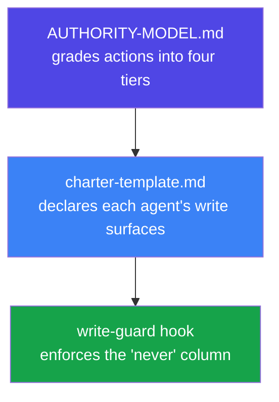

# Agent Authority Model

Governance artifacts for teams running agents in real work: how much autonomy an
agent gets, written down and enforced.

Most teams converge on one autonomy tier — *propose-only* — because it is the
default nobody has to argue for. It produces approval fatigue, a task queue that
only grows, and a human who approves without reading. Gartner names uniform
governance as a *cause* of agent programme failure. This pattern is the
proportional alternative.

## Contents

| File | What it is |
|------|------------|
| [AUTHORITY-MODEL.md](./AUTHORITY-MODEL.md) | **Agent Authority Model v0.1** — the four-tier model (Act / Act & tell / One action / Decide), the inverted default, and inbox depth as a failure signal |
| [charter-template.md](./charter-template.md) | A fill-in template giving an agent persona a written charter: role, reporting line, declared write surfaces, escalation path, maker–checker review |

## The four tiers

| Tier | Rule | Human involvement |
|------|------|-------------------|
| **A — Act** | The agent acts. No notice. | None |
| **B — Act & tell** | The agent acts, then reports. Reversible, internal blast radius. | Read one line |
| **C — One action** | The agent prepares until exactly one human action remains. | One tap |
| **D — Decide** | The human decides. The agent researches and recommends only. | Judgment |

**The default is A.** An agent may not file a human task without first testing
whether the action fits A, B, or C — and every task it does file must state why
it could not be executed.

## How the pieces fit

A charter is a statement of intent. A hook is a control. The *never* column of a
charter's write-surface table is what belongs in a
[write-guard config](../write-guard-hook/) — see that pattern for the enforcement
half.

## Status

`v0.1` — derived from one operator's audit of their own agent estate and
reconciled against published Gartner and Okta findings. Published for adaptation,
not as a standard. Boundaries and known limits are stated in
[AUTHORITY-MODEL.md](./AUTHORITY-MODEL.md#boundaries-of-this-model).

## License

MIT
