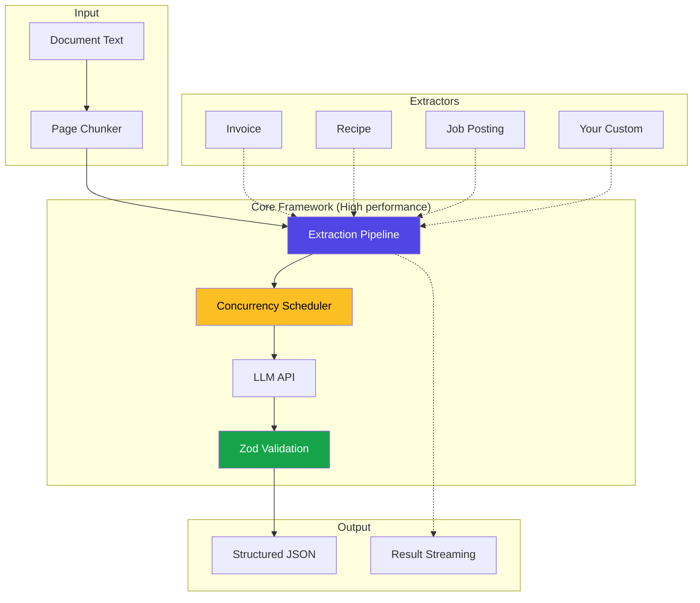
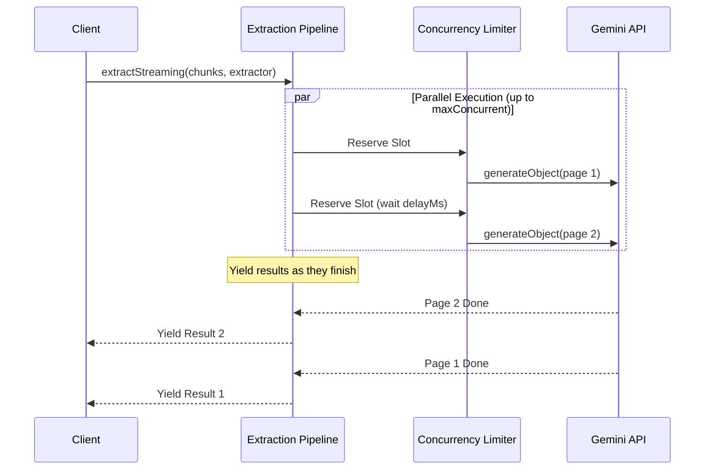
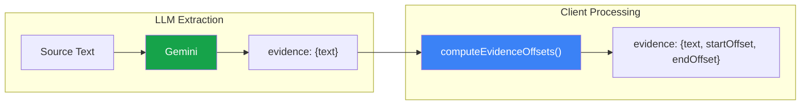
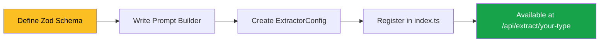
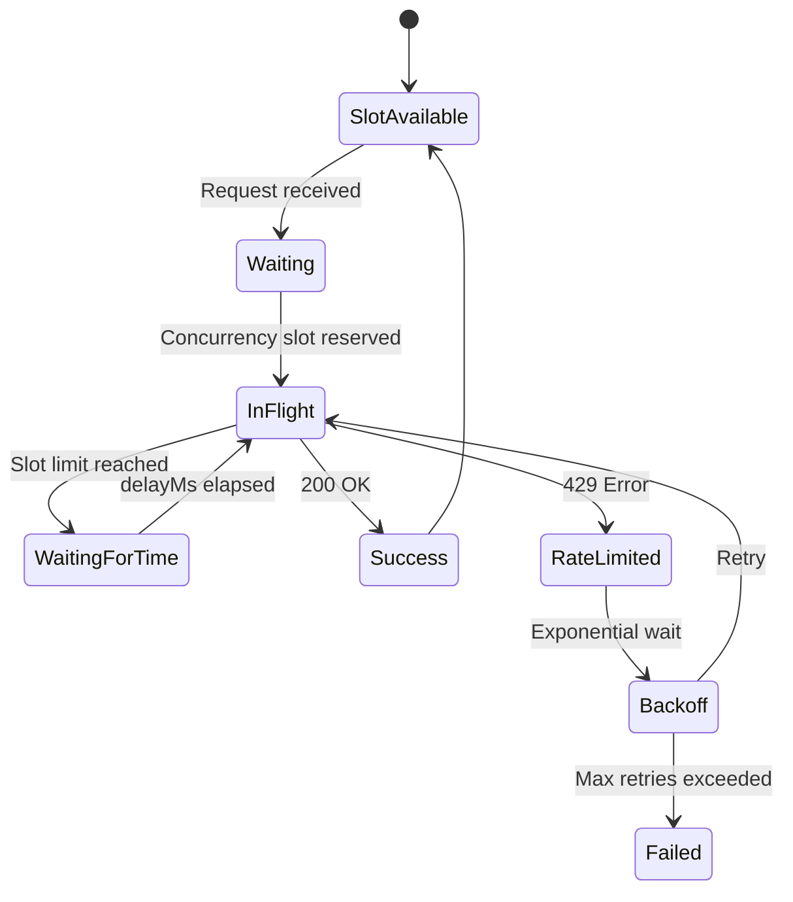

# AI Extraction Patterns

Resilient, structured data extraction from unstructured text using LLMs.

## What This Solves

When extracting structured data from documents using LLMs, you'll encounter:

| Problem | This Framework's Solution |
|---------|--------------------------|
| Large documents timeout | Page-by-page processing |
| JSON parsing fails | Structured output with Zod schemas |
| Rate limits (429 errors) | Automatic delays + exponential backoff |
| One failure kills everything | Per-page error isolation |

---

## Architecture Overview (with Concurrency)



---

## Extraction Flow (Parallel & Streaming)



---

## Quick Start

```bash
# Clone the repo
git clone https://github.com/your-username/ai-extraction-patterns.git
cd ai-extraction-patterns

# Install dependencies
npm install

# Set up your API key
cp .env.example .env.local
# Edit .env.local and add your GEMINI_API_KEY

# Run the dev server
npm run dev
```

Open [http://localhost:3000](http://localhost:3000) to see the demo.

---

## How It Works

### The Pattern

```typescript
// 1. Define your schema with Zod
const MyItemSchema = z.object({
  name: z.string(),
  value: z.number(),
  confidence: z.number(),
});

// 2. Create an extractor config
const myExtractor: ExtractorConfig<typeof MyItemSchema> = {
  name: "my-extractor",
  description: "Extracts items from documents",
  schema: MyItemSchema,
  buildPrompt: (text) => `Extract items from: ${text}`,
};

// 3. Use the pipeline
const pipeline = createPipeline();
const result = await pipeline.extractFromPages(chunks, myExtractor);
```

### Optimization Patterns

| Method | Best For | Description |
| :--- | :--- | :--- |
| `extractFromPages` | Simplicity | Sequential processing with standard rate limiting. |
| `extractParallel` | **Performance** | Processes all pages concurrently while respecting RPM. |
| `extractStreaming` | **UX Latency** | Yields results instantly as they arrive from the LLM. |

### Key Features

| Feature | Description |
|---------|-------------|
| **Source Grounding** | Links extracted values to exact character offsets in source text |
| **Parallel Processing** | Processes multiple pages concurrently to save time |
| **Result Streaming** | Uses AsyncGenerators to show data to users instantly |
| **Slot-based Limits** | Concurrency-aware rate limiter for Gemini 2.5 Flash |
| **Structured Output** | Uses `generateObject` + Zod for guaranteed valid JSON |
| **Error Isolation** | One page fails, the rest continue |
| **Evidence-based Deduplication** | Removes duplicates using source text, not just parsed values |

---

## Source Grounding

Source grounding links every extracted value back to its exact location in the source document. This improves precision by:

1. **Reducing hallucinations** — The LLM must prove where the data came from
2. **Enabling verification** — Users can click an extracted value to see its source
3. **Better deduplication** — Compare by source text, not parsed values

### Design Decision: Client-Side Offset Computation

> [!IMPORTANT]
> **LLMs are prediction engines, not calculators.**
>
> We don't ask the LLM to compute character offsets — it would just "predict" plausible numbers.
> Instead, the LLM returns only the **evidence text**, and we compute offsets deterministically
> using `indexOf()`. This approach:
> - **Reduces output tokens by ~25%**
> - **Eliminates hallucinated offsets**
> - **Improves latency**



### How It Works

1. **LLM extracts values** and returns the exact source text as evidence (no offsets)
2. **Client computes offsets** using `indexOf()` — deterministic and accurate
3. **UI highlights the source** using the computed offsets

### EvidenceSpan Types

```typescript
// LLM output (text only)
interface RawEvidenceSpan {
  text: string;  // Exact text copied from source
}

// After client-side processing (with offsets)
interface EvidenceSpan {
  text: string;
  startOffset: number;
  endOffset: number;
}

// Compute offsets client-side
import { computeEvidenceOffsets } from "@/lib/core";

const span = computeEvidenceOffsets(sourceText, "$6,000.00");
// { text: "$6,000.00", startOffset: 50, endOffset: 59 }
```

### Example LLM Output (text-only evidence)

```json
{
  "description": "Web Development Services",
  "total": 6000,
  "confidence": 0.95,
  "evidence": {
    "descriptionSpan": { "text": "Web Development Services" },
    "totalSpan": { "text": "$6,000.00" }
  }
}
```

### GroundingViewer Component

The UI computes offsets before passing to `GroundingViewer`:

```tsx
import { GroundingViewer } from "@/app/components/grounding-viewer";

// Compute offsets from raw evidence
const span = computeEvidenceOffsets(inputText, item.evidence.totalSpan.text);

<GroundingViewer
  sourceText={invoiceText}
  highlights={[{ id: "item-1", span, color: "yellow", label: "Total" }]}
  onHighlightClick={setSelectedItem}
/>
```


## Built-in Extractors

| Extractor | Use Case | Fields Extracted |
|-----------|----------|------------------|
| 📄 **Invoice** | Financial documents | description, quantity, unit_price, total, **evidence** |
| 🍳 **Recipe** | Cooking blogs | ingredients, steps, prep_time, cook_time |
| 💼 **Job Posting** | Career sites | title, company, requirements, salary, benefits |

---

## Create Your Own Extractor



**Step 1:** Create `lib/extractors/my-type/index.ts`

```typescript
import { z } from "zod";
import { ExtractorConfig } from "../../core";

export const MySchema = z.object({
  field1: z.string(),
  field2: z.number(),
  confidence: z.number(),
});

export function buildPrompt(text: string): string {
  return `Extract data from: ${text}`;
}

export const myExtractor: ExtractorConfig<typeof MySchema> = {
  name: "my-type",
  description: "My custom extractor",
  schema: MySchema,
  buildPrompt,
};
```

**Step 2:** Register in `lib/extractors/index.ts`

See [docs/create-your-own-extractor.md](docs/create-your-own-extractor.md) for the full guide.

---

## API Usage

```bash
# Extract from text
curl -X POST http://localhost:3000/api/extract/invoice \
  -H "Content-Type: application/json" \
  -d '{"text": "Your invoice text here..."}'

# List available extractors
curl http://localhost:3000/api/extract
```

### Request Options

```json
{
  "text": "Your document text...",
  "options": {
    "autoChunk": true,
    "maxChunkSize": 4000
  }
}
```

---

## Project Structure

```
ai-extraction-patterns/
├── app/
│   ├── page.tsx                 # Demo playground UI
│   └── api/extract/
│       ├── route.ts             # GET: List extractors
│       └── [type]/route.ts      # POST: Run extraction
│
├── lib/
│   ├── core/                    # 🔧 Framework (don't modify)
│   │   ├── types.ts             # ExtractorConfig interface
│   │   ├── rate-limiter.ts      # Rate limiting + backoff
│   │   └── extraction-pipeline.ts
│   │
│   └── extractors/              # 📦 Examples (copy & customize)
│       ├── invoice/
│       ├── recipe/
│       └── job-posting/
│
└── docs/
    └── create-your-own-extractor.md
```

---

## Concurrency & Slot Strategy



Default configuration:
- **Delay between calls:** 7 seconds
- **Max retries:** 3
- **Backoff multiplier:** 2x per retry

---

## Tech Stack

| Technology | Purpose |
|------------|---------|
| [Next.js 15](https://nextjs.org/) | React framework |
| [Vercel AI SDK](https://sdk.vercel.ai/) | Unified LLM interface |
| [Gemini](https://ai.google.dev/) | Google's LLM |
| [Zod](https://zod.dev/) | Schema validation |
| [Tailwind CSS](https://tailwindcss.com/) | Styling |

---

## License

MIT
