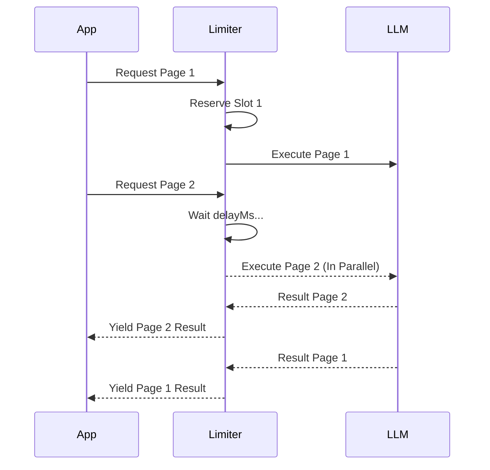

# Latency Optimization Patterns

This document explains the high-performance extraction patterns implemented in the framework to minimize latency while respecting LLM rate limits.

## Why Latency Matters in Extraction

Processing large documents (100+ pages) page-by-page can be slow. If each page takes 5-10 seconds and is processed sequentially, a large document could take 10+ minutes.

We solve this using two key patterns:
1. **Parallel Extraction**: Reducing total wall-clock time.
2. **Result Streaming**: Reducing *perceived* latency by showing results as they arrive.

---

## Pattern 1: Concurrency-Aware Rate Limiting

The core of our optimization is a refactored `RateLimiter` that manages "slots" rather than simple pauses.

### How it works:
- **Slot Scheduling**: When a request is queued, the limiter calculates exactly when it's allowed to start based on the `delayMs`.
- **Concurrency Management**: It uses a `maxConcurrent` counter to allow multiple "in-flight" requests simultaneously, up to the limit of your API tier.



---

## Pattern 2: Parallel Page Processing

Instead of a simple `for` loop, `extractParallel` maps all pages to promises and manages them through the concurrency-aware limiter.

### Benefits:
- **Performance**: Total time is roughly `(TotalPages / maxConcurrent) * AveragePageTime`.
- **Reliability**: Still maintains error isolation per page.

---

## Pattern 3: Result Streaming

`extractStreaming` returns an `AsyncGenerator` that yields results as soon as any page finishes, regardless of the original page order.

### Use Cases:
- **Real-time UIs**: Update progress bars or data tables instantly.
- **Lazy Loading**: Start processing the first few results while others are still being extracted.

```typescript
for await (const pageResult of pipeline.extractStreaming(pages, extractor)) {
    console.log(`Page ${pageResult.pageNumber} ready!`);
    updateUI(pageResult.items);
}
```

---

## Configuring for Gemini 2.5 Flash

Gemini 2.5 Flash has generous rate limits compared to Pro, making it ideal for high-concurrency extraction.

| Plan | RPM (Requests Per Minute) | Recommended `maxConcurrent` |
| :--- | :--- | :--- |
| **Free Tier** | 15 RPM | 2-3 |
| **Pay-As-You-Go** | 2000 RPM | 50+ (limited by client bandwidth) |

> [!TIP]
> Always set `maxConcurrent` slightly lower than your RPM limit to account for retries and network jitter.
