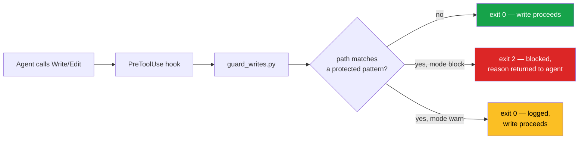

# Write Guard Hook

A config-driven `PreToolUse` hook for Claude Code that blocks agent writes to
protected paths.

Some files in a repository should never be edited by an agent — contracts,
decision records, production infrastructure, anything holding secrets. A line in
`CLAUDE.md` saying so is a suggestion. This is a control: the tool call is
blocked before it runs, and the agent is told why.

**Dependencies:** none. Python 3.8+, standard library only.

---

## What This Solves

| Problem | This hook's solution |
|---------|----------------------|
| Instructions in `CLAUDE.md` are advisory — an agent can talk itself past them | The tool call is blocked at the harness level, before execution |
| Guard scripts hardcode paths, so every change is a code edit | Paths live in `.write-guard.json`; the script is never edited |
| A block with no explanation gets retried in a loop | The block message names the pattern, the reason, and the config file |
| You cannot tell what a guard covers without reading it | `--list` prints the active config; `--check` tests one path |
| A broken guard silently blocks all work | Config errors and malformed payloads fail non-blocking, never wedging the session |

---

## How It Works



The hook reads the `PreToolUse` payload on stdin, pulls the target path out of
`tool_input`, resolves it relative to the project root, and matches it against
the patterns in your config. On a match in `block` mode it exits `2`, which is
the Claude Code contract for "block this tool call and feed stderr back to the
model."

---

## Install

**Step 1 — copy the script into your project**

```bash
mkdir -p .claude/hooks
curl -o .claude/hooks/guard_writes.py \
  https://raw.githubusercontent.com/ChainSpark-Global-LLC/chainspark-oss/main/patterns/write-guard-hook/guard_writes.py
chmod +x .claude/hooks/guard_writes.py
```

**Step 2 — create `.write-guard.json` at your project root**

```json
{
  "mode": "block",
  "protected": [
    { "pattern": "legal/", "reason": "Contracts change only by human instruction." },
    { "pattern": ".env*", "reason": "Secrets never move through an agent." }
  ]
}
```

**Step 3 — register the hook in `.claude/settings.json`**

```json
{
  "hooks": {
    "PreToolUse": [
      {
        "matcher": "Write|Edit|MultiEdit|NotebookEdit",
        "hooks": [
          {
            "type": "command",
            "command": "python3 \"$CLAUDE_PROJECT_DIR/.claude/hooks/guard_writes.py\""
          }
        ]
      }
    ]
  }
}
```

**Step 4 — verify before you rely on it**

```bash
python3 .claude/hooks/guard_writes.py --list            # show the active config
python3 .claude/hooks/guard_writes.py --check legal/x.md # expect BLOCK
python3 .claude/hooks/guard_writes.py --check src/app.ts # expect ALLOW
python3 .claude/hooks/guard_writes.py --selftest         # match-logic tests
```

Then start a session and ask the agent to edit a protected file. If it is not
blocked, the hook is not wired up — check that `.claude/settings.json` parses and
that the script is executable.

---

## Configuration

`.write-guard.json` at the project root, or `.claude/write-guard.json`. The hook
walks up from the session's working directory until it finds one. Set
`WRITE_GUARD_CONFIG` to point somewhere else.

```json
{
  "mode": "block",
  "protected": [
    { "pattern": "legal/", "reason": "why this is protected" },
    "*.pem"
  ],
  "allow": ["legal/README.md"]
}
```

| Key | Type | Meaning |
|-----|------|---------|
| `mode` | `"block"` \| `"warn"` | `block` stops the call. `warn` logs and allows — use it to trial a ruleset before enforcing. Default `block`. |
| `protected` | array | Patterns to guard. Each entry is either a bare string or `{ "pattern", "reason" }`. The reason is shown to the agent, so write it for the agent. |
| `allow` | array of strings | Exceptions, evaluated **before** `protected`. A path matching `allow` is never blocked. |

### Pattern syntax

Patterns are matched against the path **relative to the project root**, using
forward slashes.

| Pattern | Matches |
|---------|---------|
| `legal/` | Everything under `legal/`, at any depth |
| `legal` | Same — a bare directory name covers its contents |
| `docs/decisions.md` | That exact file |
| `infra/prod/**` | Everything under `infra/prod/` |
| `*.pem` | Any `.pem` file at any depth — a pattern with no `/` also matches on basename |
| `.env*` | `.env`, `.env.local`, `.env.production` |

`*` matches across directory separators, so `legal/*` and `legal/**` behave the
same way. This is deliberately broader than `.gitignore` semantics: for a guard,
over-matching is the safe direction.

---

## Worked Example

A repository where contracts, the decision record, and production Terraform are
human-only, but the `legal/README.md` index is fine for an agent to maintain.

`.write-guard.json`:

```json
{
  "mode": "block",
  "protected": [
    {
      "pattern": "legal/",
      "reason": "Contracts and legal instruments change only by human instruction."
    },
    {
      "pattern": "docs/decision-register.md",
      "reason": "The decision record is the audit trail. Agents propose; humans write."
    },
    {
      "pattern": "infra/prod/**",
      "reason": "Production infrastructure is human-applied."
    },
    {
      "pattern": ".env*",
      "reason": "Secrets never move through an agent."
    }
  ],
  "allow": ["legal/README.md"]
}
```

What the agent sees when it tries `Write` to `legal/msa.md`:

```
BLOCKED: Write to 'legal/msa.md' is not permitted.
Matched protected pattern: 'legal/'
Reason: Contracts and legal instruments change only by human instruction.
Config: /project/.write-guard.json
If this change is intended, ask the human who owns this repository to make it,
or to amend the config.
```

The agent stops, reports the block, and moves on. It does not retry — the
message says what would have to change and who changes it.

A runnable version of this scenario, with assertions:

```bash
./examples/worked-example.sh
```

---

## Limitations

Read these before relying on the hook.

- **It guards file-write tools, not the shell.** An agent running
  `bash -c 'echo x > legal/msa.md'` is not covered. Guard `Bash` separately, or
  use Claude Code's permission rules to deny writes through the shell.
- **It fails open.** No config, a malformed config, or an unparseable payload
  allows the write and logs to stderr. This is a deliberate trade: a guard that
  fails closed on a typo blocks all work, and the usual response is to disable
  the guard. If you need fail-closed, change the `return 1` branches in
  `run_hook()` to `return 2`.
- **It is a guardrail, not a security boundary.** It constrains a cooperating
  agent working inside your harness. It is not a defence against an adversary
  who controls the process.
- **Patterns match paths, not content.** A secret pasted into an unprotected
  file is not caught.

---

## Related

- [Agent Authority Model](../agent-authority-model/AUTHORITY-MODEL.md) — the
  four-tier model this hook enforces the bottom tier of.
- [Agent Charter Template](../agent-authority-model/charter-template.md) — the
  charter's *never* column is what belongs in `.write-guard.json`.
- [Claude Code hooks documentation](https://code.claude.com/docs/en/hooks)

---

## License

MIT
